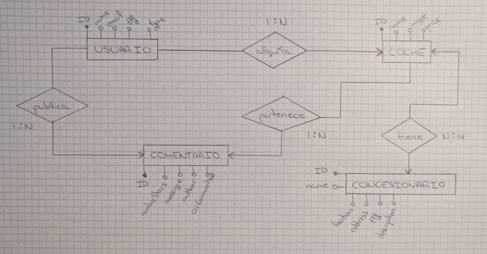

Grupo 16
Nombre de la web: AlquilaYa

Desarrolladores:
  Iván López Gordo            i.lopezgo.2023@alumnos.urjc.es          GusanoFurioso,
  Carlos Moreno Cano          f.aragones.2023@alumnos.urjc.es         roomtrash6,
  Fermín Aragonés González    c.morenoc.2022@alumnos.urjc.es          awawdasdad,
  Óscar Rodríguez Pérez       o.rodriguez.2022@alumnos.urjc.es        OscarRP15.

Descripción:
Se trata de una página web de alquiler de coches, donde un usuario podrá alquilar un coche, que podrá encontrarse en uno o varios concesionarios. Un usuario podrá escribir un comentario acerca del coche.

Entidades: 
Nuestra web tiene 4 entidades: Coche, Concesioario, Usuario y Comentario.
Un usuario podrá escribir varios comentarios, un coche podrá tener varios comentarios, y cada comentario pertenecerá a 1 solo usuario y a 1 solo coche (2 relaciones 1:N). Un usuario podrá alquilar varios coches, mientras que un coche podrá ser alquilado por 1 solo usuario (Relación 1:N). Además, un coche podrá ser alquilado en varios concesionarios, y cada concesionario podrá tener varios coches (Relación N:M).

Permisos:
Habrá un Usuario administrador, que se encargará del borrado, editado e implementación de coches y concesionarios, y luego un Usuario cliente que podrá alquilar coches y añadir comentarios.

Diagrama E/R:

Iván López Gordo:
Se ha encargado de adaptar todos los repositories, añadir todas las anotaciones y las asociaciones de todas las clases de java, añadir las dependencias necesarias para MySQL en el pom.xml y ampliar el aplication.properties con todo lo necesario para usar MySQL en el proyecto. Además, ha modificado el SampleDataService.java para ir añadiendo los datos de ejemplo de la web en orden para que la base de datos no de errores, y algunos Services y Controllers puesto que algunos métodos del repository, al insertar la base de datos, cambian sus parámetros de entrada.

  Commits más relevantes:
    Todo o casi todo el código Spring para la base de datos [aquí](https://github.com/DWS-2025/project-grupo-16/commit/6739985).
    Cambio de h2 a MySQL [aquí](https://github.com/DWS-2025/project-grupo-16/commit/2c15d27).
    Cambio en aplication.properties [aquí](https://github.com/DWS-2025/project-grupo-16/commit/44690d0). 

Fermín Aragonés González:
No ha hecho commits en esta parte.

Óscar Rodríguez Pérez:
No ha hecho commits en esta parte.

Carlos Moreno Cano:
Ha incluido las dependencias necesarias para h2 en el pom.xml.

  Commit más relevante:
    Dependencias para h2 en pom.xml [aquí](https://github.com/DWS-2025/project-grupo-16/commit/76ceb9d).
